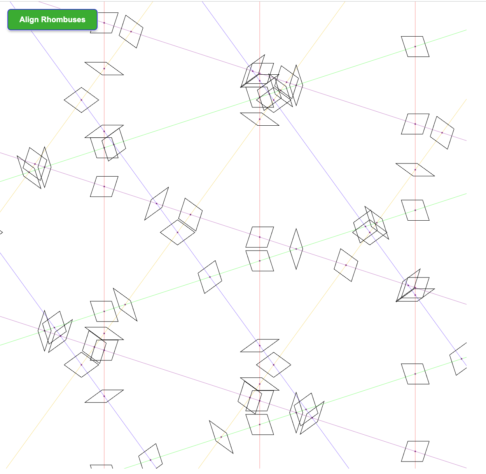
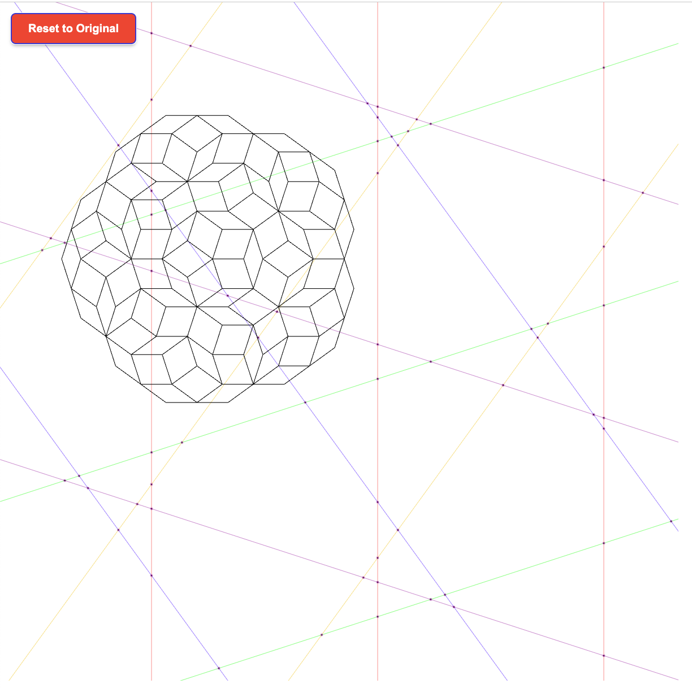
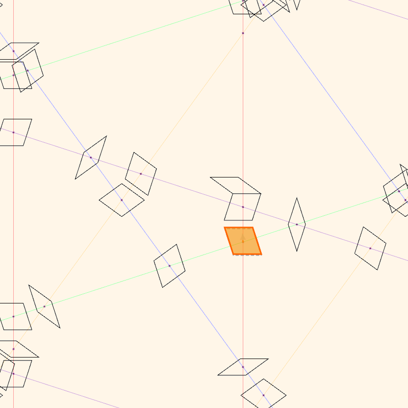

# Penrose DIY

An interactive Penrose tiling generator using the pentagrid method. Try aligning rhombuses to form beautiful aperiodic patterns!

**[Live Demo](https://fanyangxyz.github.io/penrose-diy/)** | **[Blog Post](https://fanyangxyz.github.io/penrose-ii/)**

## Overview

This project generates Penrose tilings—aperiodic patterns that never repeat—using five families of intersecting parallel lines (pentagrid method). The visualization lets you interactively drag rhombuses and watch as a progressive alignment algorithm snaps them into place to form the classic Penrose pattern.

## Examples

### Before and After Alignment
<p align="center">
  
  
</p>

### Progressive Alignment in Action
<p align="center">
  
</p>

## Features
### Visualization
- **Pentagrid rendering**: Five color-coded families of parallel lines intersecting at specific angles
- **Rhombus generation**: Automatically creates rhombi from line intersections
- **Real-time rendering**: Smooth animation using p5.js canvas

### Interaction
- **Drag & drop**: Click and drag any rhombus to reposition it manually
- **Progressive alignment**: Click "Align Rhombuses" to watch the pattern snap into place piece by piece
- **Anchor mode**: Manually positioned rhombuses become anchors for the alignment algorithm
- **Reset functionality**: Return to the original scattered state

### Algorithm
- **Pentagrid method**: Uses golden ratio (φ) based angles to create five line families
- **Adjacency graph**: Builds connections between neighboring rhombuses
- **BFS alignment**: Spreads alignment outward from seed rhombuses frame by frame
- **Smart anchoring**: Locked (manually moved) rhombuses act as fixed reference points

## Code Structure
```
penrose-diy/
├── index.html          # HTML entry point
├── sketch.js           # Main p5.js logic and setup
│   ├── Pentagrid generation (5 line families at 72° intervals)
│   ├── Intersection detection
│   ├── Rhombus creation and rendering
│   ├── Progressive alignment algorithm
│   └── Mouse interaction handlers
├── utils.js            # Utility functions
│   ├── Line intersection calculations
│   ├── Angle computations
│   ├── Polygon hit testing
│   ├── Adjacency graph construction
│   └── Alignment offset calculations
└── libraries/          # p5.js dependencies
```

## License

MIT License
